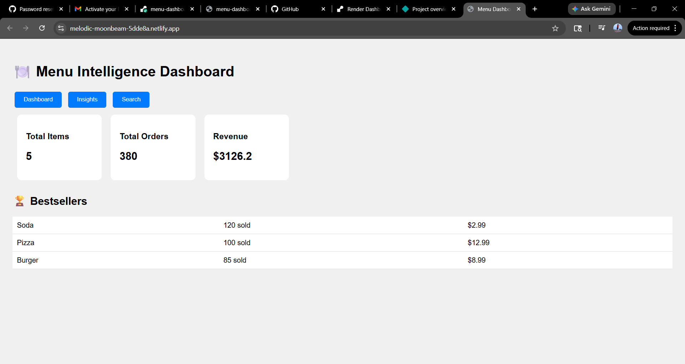
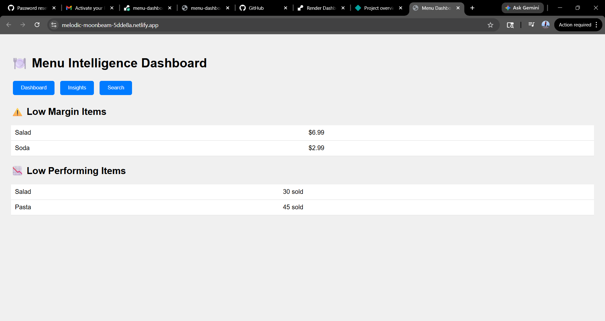

# Menu Intelligence Dashboard

Restaurant analytics dashboard showing bestsellers, low-margin, and low-performing menu items.

## 🚀 Live Demo

- **Frontend (Website):** https://your-app.netlify.app
- **Backend API:** https://menu-dashboard-api.onrender.com

## 📊 Features

- KPI Dashboard (Total items, orders, revenue)
- Top Bestsellers chart
- Low margin items list
- Low performing items list
- Search menu items

## 🛠️ Tech Stack

- FastAPI (Backend)
- HTML/CSS/JavaScript (Frontend)
- Render (Backend Hosting)
- Netlify (Frontend Hosting)

## 📸 Screenshots




## 🏃‍♂️ Run Locally

```bash
# Backend
pip install fastapi uvicorn
uvicorn backend:app --reload

# Frontend - Open index.html in browser